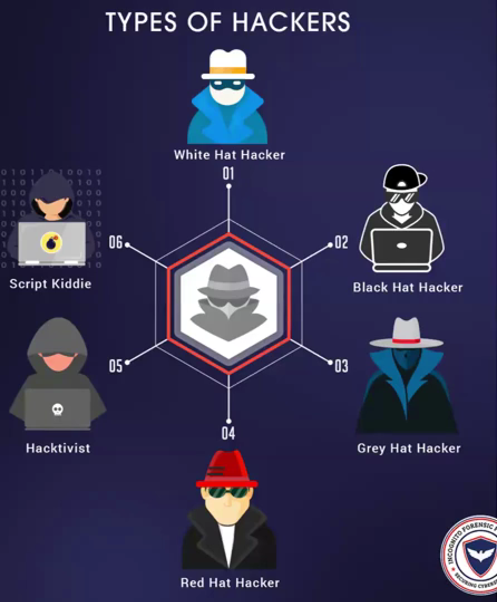

# Day 5 - Cybersecurity Session Notes

## 1. `grep` Command
The `grep` command is used to search for specific patterns or words within files or outputs.
- **Example:** `grep "root" /etc/passwd`  
  This will search for the word "root" inside the file `/etc/passwd`.

---

## 2. `grep -v ":"`
- The `-v` option **inverts** the match, meaning it will show lines **not containing** the specified pattern.
- **Example:** `grep -v ":" /etc/passwd`  
  This will display all lines that **do not** contain the `:` character.

---

## 3. `awk` Command
- `awk` is a powerful text-processing tool used to **extract and process columns or patterns** in a file.
- **Example:** `awk -F ':' '{print $1}' /etc/passwd`  
  This prints the first field (column) from each line using `:` as a delimiter.

---

## 4. `nano` Command
- `nano` is a **simple terminal-based text editor** in Linux.
- Used to create or edit files directly from the terminal.
- **Example:** `nano myscript.sh`

---

## 5. `chmod +x myip.sh`
- `chmod +x` gives **execute permission** to a file, making it a runnable script.
- **Example:** `chmod +x myip.sh`  
  This will make the `myip.sh` script executable.

---

## 6. `sudo cp -r myip /bin`
- `sudo`: Runs the command with superuser privileges.
- `cp -r`: Copies directories and their contents recursively.
- This command **copies the `myip` folder into the `/bin` directory** so it can be run globally from anywhere.

---

## 7. `man` Command
- `man` displays the **manual page** for a command.
- **Example:** `man grep`  
  This will open the manual (help) for the `grep` command.

---

## 8. Shebang (Hashbang)
- Written as `#!/bin/bash` at the top of a script.
- It tells the system **which interpreter** to use to execute the script.
- Example:
  ```bash
  #!/bin/bash
  echo "Hello, World!"


---

## 9. Script Kiddie

* A person who uses existing tools or scripts to hack systems **without understanding the underlying concepts.**
* They are usually **not skilled hackers.**

---

## 10. Hacker and Its Types

* **Hacker:** Someone who gains unauthorized access to systems or finds creative solutions to problems.

# Types of Hackers



## 1. White Hat Hacker
- **Also Known As:** Ethical Hacker
- **Purpose:** Protect systems, find vulnerabilities, and help improve security.
- **Example:** Security professionals working in organizations.

---

## 2. Black Hat Hacker
- **Also Known As:** Malicious Hacker
- **Purpose:** Break into systems illegally for personal gain or to cause harm.
- **Example:** Hackers who steal data, create viruses, or disrupt services.

---

## 3. Grey Hat Hacker
- **Purpose:** Sometimes breaks the rules but usually does not have harmful intent.
- **Example:** Hackers who find vulnerabilities without permission but report them instead of exploiting.

---

## 4. Red Hat Hacker
- **Purpose:** Actively hunt and take down black hat hackers, often using aggressive methods.
- **Example:** Cyber vigilantes who disable malicious servers and tools.

---

## 5. Hacktivist
- **Purpose:** Hack to promote political or social messages.
- **Example:** Groups like Anonymous who target governments or large corporations.

---

## 6. Script Kiddie
- **Purpose:** Use ready-made tools or scripts without deep understanding of hacking.
- **Example:** Beginners who run pre-written exploits just for fun or bragging.

---

# Summary
| Hacker Type       | Purpose                         | Legality        |
|-------------------|---------------------------------|-----------------|
| White Hat         | Ethical security improvement    | Legal           |
| Black Hat         | Malicious attacks               | Illegal         |
| Grey Hat          | Between ethical and malicious   | Usually illegal |
| Red Hat           | Fight against black hats        | Questionable    |
| Hacktivist        | Political/social hacking        | Often illegal   |
| Script Kiddie     | Play with hacking tools         | Illegal         |


## 11. Hacking

* The process of **gaining unauthorized access** to data, devices, or systems.

---

## 12. Ethical Hacking

* **Legal hacking** done with permission to identify and fix vulnerabilities.
* Ethical hackers help organizations improve security.

---

## 13. CIA Triad

* **C**onfidentiality: Protecting sensitive data from unauthorized access.
* **I**ntegrity: Ensuring data is not altered or tampered with.
* **A**vailability: Keeping systems and data accessible when needed.

---

## 14. Nagios

* An **open-source monitoring tool** used to track system health, server status, and network services.
* Alerts users if something goes wrong.

---

## 15. Bug Bounty

* A **reward system** where ethical hackers are paid for finding and reporting security bugs in applications or systems.

---
