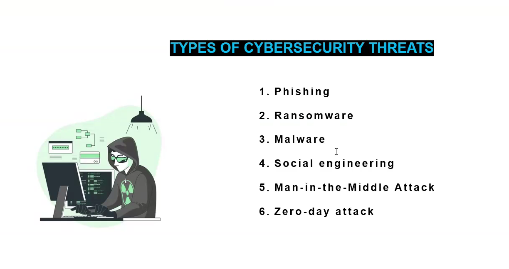
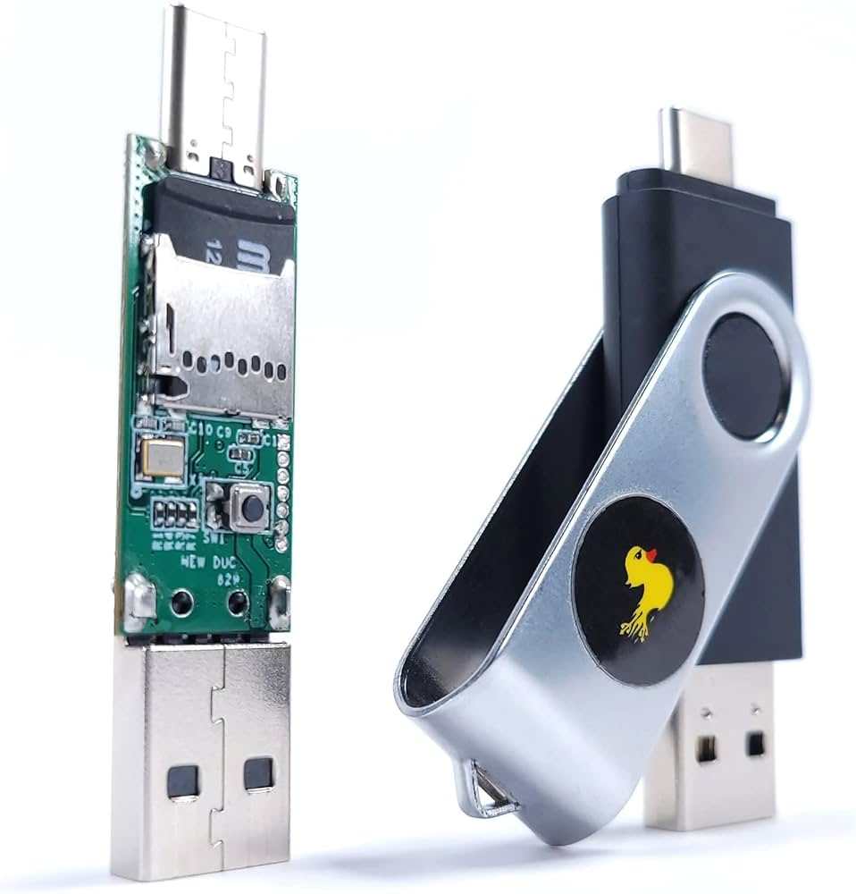
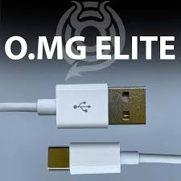

---

## 📌 Types of Cybersecurity Threats

### 1. **Phishing**

Phishing is a type of cyber attack where the attacker pretends to be a legitimate entity—like a bank, company, or even a friend—to trick the victim into revealing sensitive information such as passwords, OTPs, or credit card numbers.
**Examples:**

* Fake emails that look like PayPal or your bank asking you to "verify" your account.
* WhatsApp messages with fake job offers that ask for personal details.

---

### 2. **Ransomware**

Ransomware is a type of malware that locks or encrypts a user's files and demands a ransom to unlock them. Victims may lose access to personal files, and organizations may lose customer data or entire systems.
**Key Features:**

* Encrypted files with `.locked`, `.crypt`, or other extensions.
* A ransom note asking for Bitcoin or other crypto.

**Real Incidents:**

* **WannaCry (2017):** Affected hospitals, banks, and companies worldwide.

---

### 3. **Malware**

Malware (short for "malicious software") refers to any software that is designed to harm or exploit a computer or network.
**Types of Malware:**

* **Virus**: Attaches itself to files and spreads.
* **Worm**: Spreads without user action, often across networks.
* **Trojan Horse**: Disguised as legitimate software.
* **Spyware**: Monitors user activity and steals data.

---

### 4. **Social Engineering**

Social engineering is the act of manipulating people into giving away confidential info. Instead of attacking computers, attackers "hack humans" by preying on trust, fear, or urgency.
**Common Tricks:**

* Fake calls claiming to be "tech support"
* Asking for OTPs or passwords under pressure
* Pretending to be someone from your workplace

---

### 5. **Man-in-the-Middle (MITM) Attack**

In a MITM attack, the attacker secretly intercepts or alters communication between two parties. The victims believe they're talking directly to each other.
**Example:**

* You connect to public Wi-Fi. The hacker is the middleman between you and the actual site.
* They can read your messages, steal passwords, or inject malware.

---

### 6. **Zero-day Attack**

A zero-day attack exploits a software vulnerability that is unknown to the software vendor. Since the developers are unaware, there’s no patch available, making the attack extremely dangerous.
**Used in:**

* Espionage
* Cyber warfare
* High-level hacking operations

**Term Explanation:**
“Zero-day” means the developers have had **zero days** to fix it.

---

## 🧰 Some Popular Hacking Devices

---

### 🔌 1. Rubber Ducky

The **Rubber Ducky** is a USB device that looks like a regular flash drive, but when plugged into a computer, it acts like a keyboard and types commands at lightning speed.

**Key Features:**
- Emulates a keyboard (Human Interface Device - HID)
- Executes keystroke injection attacks using Duckyscript
- Often used to open backdoors, download malware, or steal data

**Use Case:**
Plugged into a computer, it can open PowerShell, disable security, and download a remote access tool—all in under 5 seconds.

---

### 🧠 2. O.MG Cable

The **O.MG Cable** looks like an ordinary USB charging cable, but it secretly contains a microcontroller and Wi-Fi chip, allowing attackers to control it remotely.

**Key Features:**
- Can log keystrokes, run payloads, or mimic keyboard/mouse
- Controlled via Wi-Fi from a phone or laptop
- Comes in Lightning, USB-C, and Micro-USB versions

**Use Case:**
Leave it on a desk—once the victim uses it, the attacker can connect over Wi-Fi and inject payloads in real time.

---

### 🐬 3. Flipper Zero

**Flipper Zero** is a portable, open-source multi-tool for hackers and pentesters. Shaped like a tamagotchi, it’s cute—but powerful.

**Key Features:**
- Interacts with RFID/NFC cards, gates, garage doors, IR remotes, etc.
- Can clone keycards, read digital signals, and perform radio attacks
- Includes GPIO pins for hardware hacking
- Fully programmable and extensible with plugins

**Use Case:**
You can clone your school/office RFID card, control smart home devices, or capture and replay wireless signals from remotes.

---

> ⚠️ **Note:** These tools are legal for ethical hacking and education. Using them without permission is illegal and punishable under cybercrime laws.

## 🔒 What is SSL/TLS?

SSL (Secure Sockets Layer) and TLS (Transport Layer Security) are encryption protocols that secure data transferred between a browser and a server. It prevents eavesdropping and tampering.

---

## 🍪 What is a Cookie and Why Do Hackers Want It?

Cookies are small pieces of data stored by websites on your browser. They store session info, login status, and preferences.

**Hackers target cookies** to:
- Hijack user sessions
- Steal login credentials
- Perform cross-site scripting (XSS)

---

## 🕵️ What is Zerodium?

Zerodium is a company that buys high-end zero-day exploits and vulnerabilities for premium payouts. It does not report them publicly but sells them to government and law enforcement.

---

## 💻 Popular Operating Systems for Hacking

- **Kali Linux**: A Debian-based OS with 600+ penetration testing tools. Originally created as *BackTrack Linux*, it’s now the go-to OS for ethical hackers.
- **Parrot OS**: Lightweight Debian-based distro used for security, privacy, and development.
- **BlackArch**: Based on Arch Linux, used for advanced penetration testing.
- **Garuda Linux**: A user-friendly Arch-based distro; not primarily for hacking but can be customized for security research.

---

## 🐉 Kali Linux: A Short History

- **BackTrack (2006–2013)**: Predecessor based on Ubuntu.
- **Kali Linux (2013–Present)**: Developed by Offensive Security, shifted to Debian base. Known for tools like Metasploit, Wireshark, Burp Suite, and more.

---

## 🔍 What is SEO?

**SEO (Search Engine Optimization)** is the process of optimizing websites to rank higher in search engine results. It involves:
- Keyword usage
- Mobile-friendliness
- Page speed
- Backlinks

Although not a security topic, SEO is often abused in **Black Hat SEO** techniques for spreading malware or phishing through higher search visibility.

--- 
