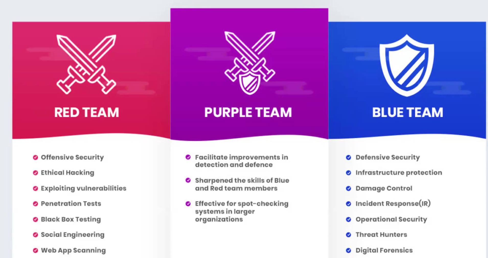

---

# 🌐 Day 01 - Introduction to Cybersecurity & Ethical Hacking

Welcome to Day 1 of the Cybersecurity Bootcamp. This session introduces the foundational concepts of cybersecurity and ethical hacking. Here's a quick overview and key takeaways for Level 1 learners.

---

## 🔐 What is Cybersecurity?

Cybersecurity refers to the **practice of protecting systems, networks, and programs** from digital attacks. These cyberattacks are typically aimed at:

* Accessing, changing, or destroying sensitive information
* Interrupting normal business operations
* Extorting money from users or organizations

Effective cybersecurity requires a **layered defense** strategy across computers, networks, and applications.

---

## 🎯 3 Domains in Cybersecurity

Cybersecurity professionals often specialize in one of three main domains:

| Domain          | Color Team   | Role Description                                                                              |
| --------------- | ------------ | --------------------------------------------------------------------------------------------- |
| **Blue Team**   | 🟦 Defensive | Protects systems from attacks. Involves monitoring, detection, and response.                  |
| **Red Team**    | 🟥 Offensive | Simulates real-world attacks to identify vulnerabilities. Ethical hackers.                    |
| **Purple Team** | 🟪 Hybrid    | Bridges the gap between red and blue teams. Facilitates communication and strategy alignment. |

---

### 🔴 Red Team

* **Focus:** Offensive Security
* **Key Activities:** Ethical hacking, penetration testing, vulnerability exploitation

**🧠 Real-World Scenario:**
A financial company wants to test the security of its online banking portal. The Red Team acts like real attackers—using phishing emails, trying to bypass authentication systems, and probing web apps for flaws—to uncover vulnerabilities before malicious actors can exploit them.

---

### 🔵 Blue Team

* **Focus:** Defensive Security
* **Key Activities:** Threat detection, incident response, system hardening

**🧠 Real-World Scenario:**
A hospital IT department notices suspicious logins from unknown IP addresses. The Blue Team investigates the logs, blocks malicious traffic, updates firewall rules, and performs digital forensics to ensure that no sensitive medical data was compromised.

---

### 🟣 Purple Team

* **Focus:** Integration and Collaboration
* **Key Activities:** Bridging Red and Blue Teams, optimizing detection and defense strategies

**🧠 Real-World Scenario:**
In a software company, the Red Team simulates a ransomware attack. The Blue Team responds and contains the threat. Afterward, the Purple Team evaluates both performances, suggests improvements in logging, detection tools, and team coordination—enhancing the organization’s overall defense capability.

---

## 🧠 Key Points to Learn for Level 1 (Beginner)

* Understand **basic cybersecurity terminology**
* Get familiar with the **roles of Blue, Red, and Purple Teams**
* Learn the **importance of ethical hacking** in identifying and fixing security flaws
* Explore **real-world applications** of cybersecurity for data protection
* Set up your environment with tools like **Linux terminal**, **Kali Linux**, and **VirtualBox**
* Begin practicing **safe and legal hacking techniques** for educational purposes

---

## 📚 What's Next?

In upcoming sessions, you will:

* Explore ethical hacking tools and techniques
* Begin hands-on simulations and exercises
* Learn the basics of **reconnaissance**, **scanning**, and **exploitation**

---

> 🚨 **Disclaimer:** All tools and methods discussed are for **educational purposes only**. Never perform unauthorized activities on systems you do not own or have explicit permission to test.

---

**Happy Hacking! 🧑‍💻**

---

